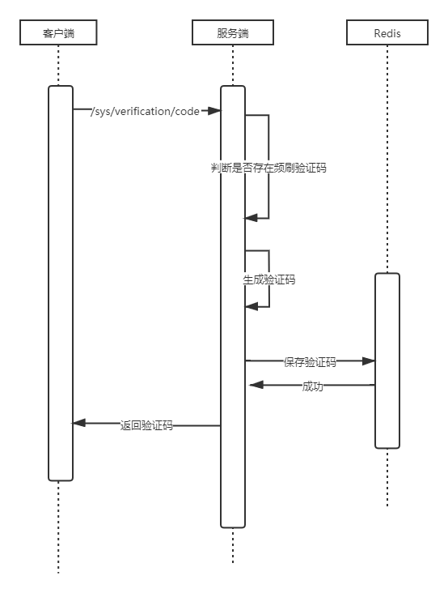
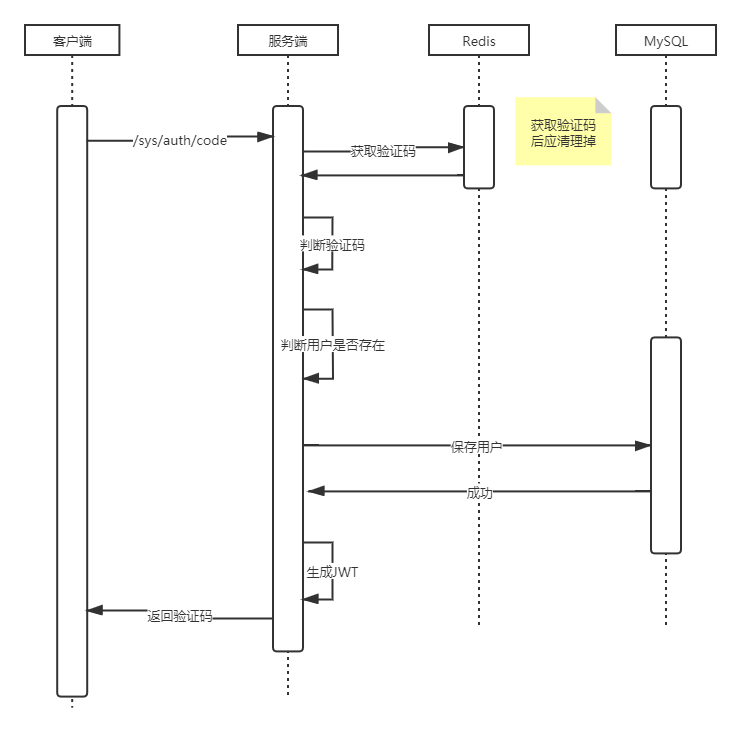
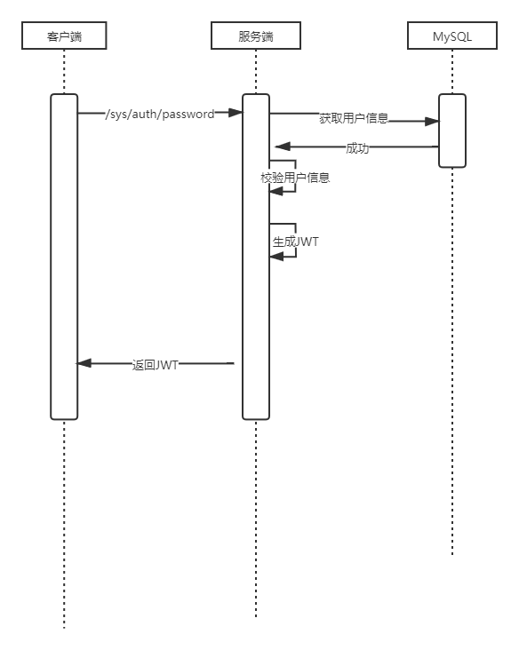

# 开发文档

## 修订日志

|    日期    |  版本  | 变化 | 简要描述     | 作者  |
| :--------: | :----: | :--: | :----------- | ----- |
| 2021-08-10 | V0.0.1 |  A   | 新增文档描述 | ch3ng |

变化状态:A——增加，M——修改，D——删除

## 1. 前言
该文档用于描述们如何指引开发该项目。

## 2. 约定俗成

### 2.1 Request/Response
该项目设计的HTTP协议的请求均采用Rustful的标准。

#### 2.1.1 Requset 
暂无

#### 2.1.2 Response
响应体尽量使用application/json，无法使用的视情况而定，比如文件下载等。

| 名称   | 描述     | 类型   |
| :----- | -------- | ------ |
| code   | 响应码   | int    |
| result | 响应数据 | object |

#### 2.1.3 缩写与术语
| 缩写/术语 | 描述     |
| :--- | -------- |
| deviceId | 设备ID,用于标识全局唯一的客户端的设备   |
| device | 设备，pc/mobile/web |
| OS | 操作系统，windows 10.202030/ios 14.5/android 11/ubuntu 20.04 |

### 2.2 接口权限

#### 2.2.1 访问权限
接口访问权限使用JWT协议。

#### 2.2.2 数据权限
暂无

#### 2.2.3 JWT 组成结构体
暂无

#### 2.3 接口交互闭环

##### 2.3.1 方案1
1. 当通过获取权限接口（登入接口）成功响应后，服务端会在响应头中设置JWT类型的token，表现为，key为"Authorization",value为JWT token;
2. 通过上面获取到的token,将作为以后接口请求时的权限信息，表现为在请求头中设置，key为"Authorization",value为JWT token;
3. 不同的设备（客户端）获取的token时效不定，一般是移动端 > 桌面端 > web端；
4. 每次请求服务端都将在响应头中返回该权限信息；
5. 移动端和桌面端在24小时外请求接口且该token为有效时，服务端将自动为其刷新token，放入响应头中进行返回，因此这个刷新时间可能出现在任何时候，这里要求桌面端和移动端每次都将响应头中的token进行保存更新到本地。

##### 2.3.2 方案2

1. 当通过获取权限接口（登入接口）成功响应后，服务端会在响应体中返回JWT类型的accessToken，以及用于刷新accessToken的refreshToken；
2. 通过上面获取到的token,将作为以后接口请求时的权限信息，表现为在请求头中设置，key为"Authorization",value为JWT token;
3. 不同的设备（客户端）获取的token时效不定，一般是移动端 > 桌面端 > web端；
4. 在某次接口请求的过程中，如果该接口返回token失效（特定的响应码），表明可能需要从新获取权限，重新登入或者刷新token


## 3. API

### 3.1 验证码

#### 3.1.1 接口描述

该接口用于发送登入（注册）时的手机验证码功能。该接口要防止被爆破。

+ 请求

  + method:post

  + uri:/sys/verification/code

  + Content-Type:application/json

  + ```json
    {
        "account":"15100000" //手机号或者时邮箱
    }
    ```

+ 响应

  + ```json
    {
        "code":200,
        "result":"success"
    }
    ```

  + ```json
    {
        "code":250,
        "result":"访问频繁"
    }
    ```

#### 3.1.2 时序图



### 3.2 验证码登入

#### 3.2.1 接口描述

使用3.1章节中的验证码进行登入

+ 请求

  + method:post

  + uri:/sys/auth/code

  + Content-Type:application/json

  + ```json
    {
        "account":"15100000", //手机号或者时邮箱
        "deviceId":"f923n23ba3",
        "vCode":"121331"
    }
    ```

+ 响应

  + ```json
    {
        "code":200,
        "result":"success"
    }
    ```

  + ```json
    {
        "code":250,
        "result":"用户名或者验证码错误"
    }
    ```

#### 3.2.2 时序图



### 3.2 密码登入

#### 3.2.1 接口描述

当用户在后续中，主动设置密码后可用该方式进行登入

+ 请求

  + method:post

  + uri:/sys/auth/password

  + Content-Type:application/json

  + ```json
    {
        "account":"15100000", //手机号或者时邮箱
        "password":"9345nasd92342", //md5值
        "deviceId":"f923n23ba3"
    }
    ```

+ 响应

  + ```json
    {
        "code":200,
        "result":"success"
    }
    ```

  + ```json
    {
        "code":250,
        "result":"用户名或者密码错误"
    }
    ```

#### 3.2.2 时序图



## 附录

### 状态码
| 状态码 | 描述     |
| :--- | -------- |
| 200 | 成功响应 |
| 250 | 错误响应 |
| 301 | token错误 |
| 302 | token失效 |
| 303 | 参数错误 |
| 304 | 预期结果与实际结果不符合 |
| 404 | 接口不存在 |
| 500 | 服务器内部错误 |
