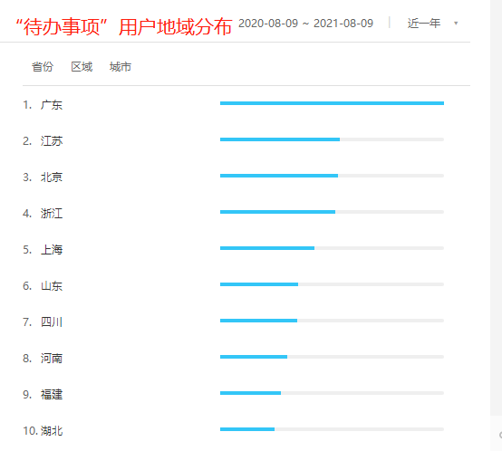
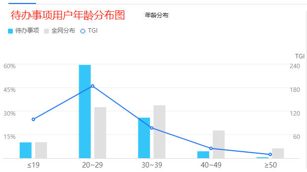
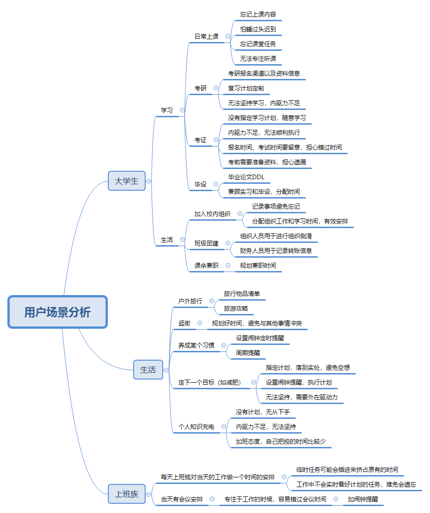
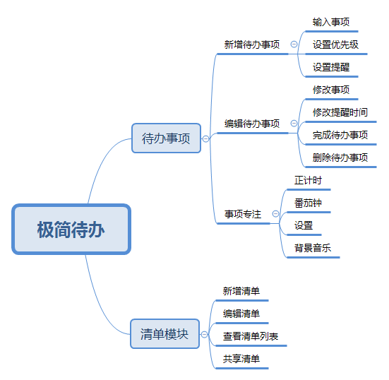
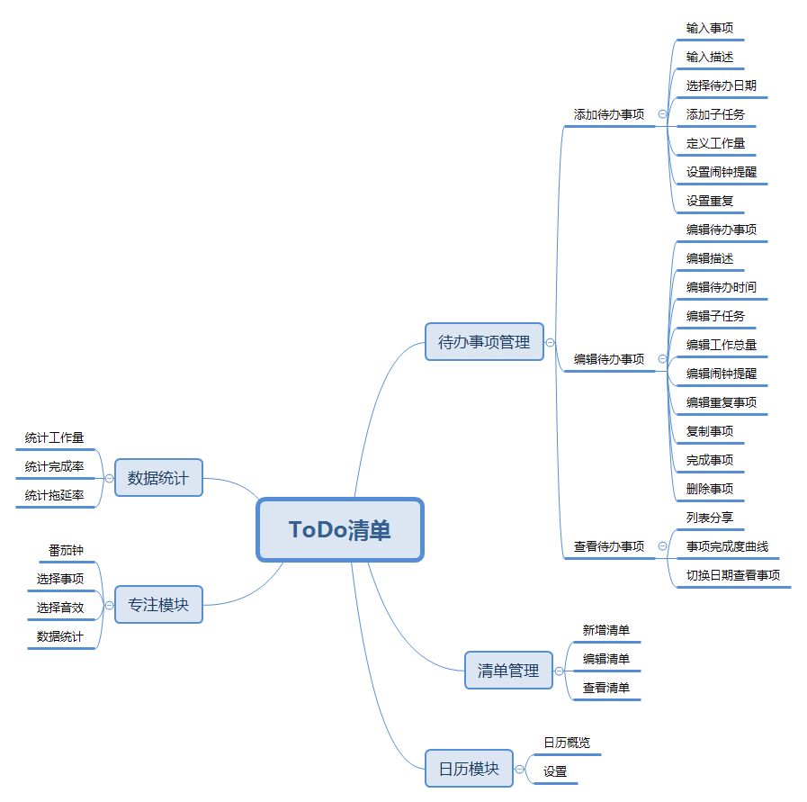
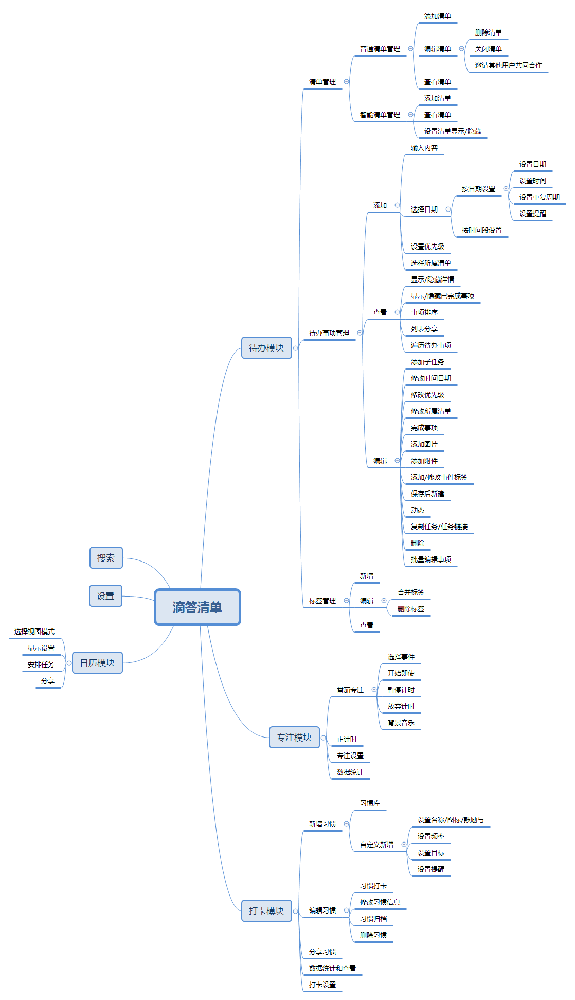
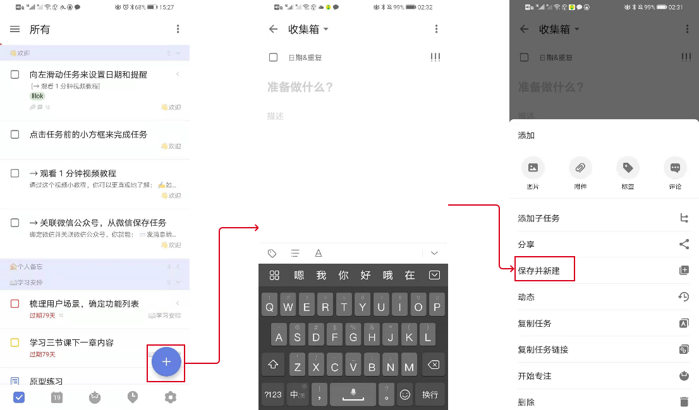
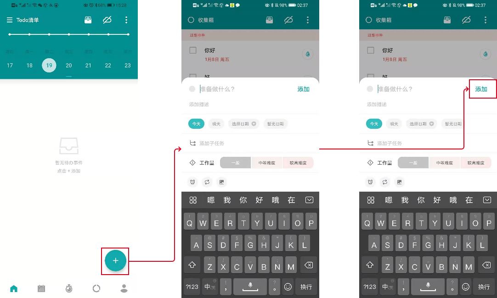
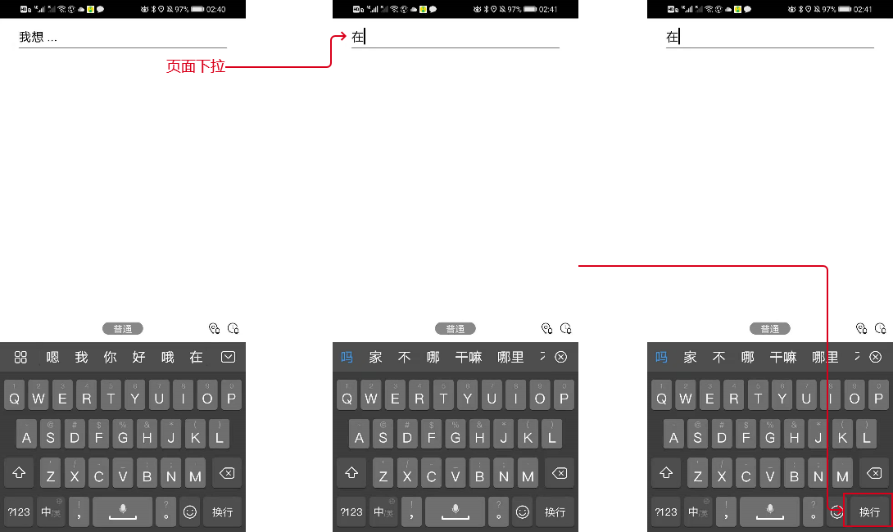
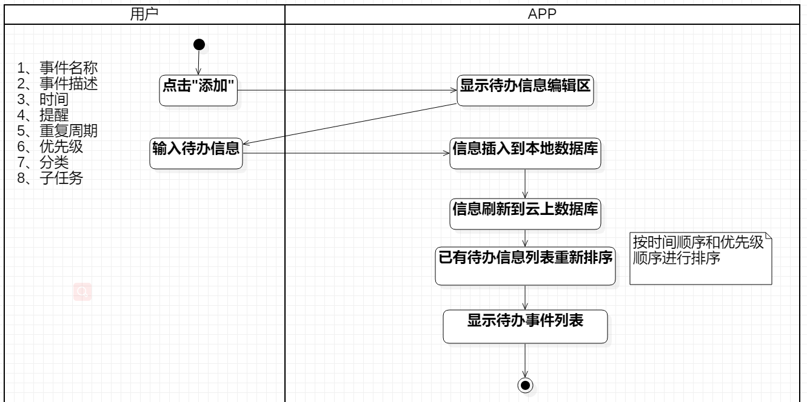

# TODO-项目介绍

## 相关文献

- TODO 最适合练习主流框架的应用：https://blog.csdn.net/qq_15988951/article/details/82905683
- 编写一个非常精美的Fultter Todo-List项目：https://segmentfault.com/a/1190000019972838

-  滴答清单最强任务管理系统：https://www.jianshu.com/p/26113da88908
- 待办清单：功能点调研及产品需求文档：http://www.woshipm.com/evaluating/4261554.html

## 确定需求

待讨论，以下为已有需求，可以根据讨论进行调整改动

## 产品分析

### 用户分析

1. 用户地域分布

结论：对于待办事项管理意识比较强的人，多数分布于一线城市，自我管理意识比较强

2. 用户年龄分布

### 需求场景分析

### 竞品分析

### 核心功能分析——添加事件

1. 滴答清单

2. todo清单

3. 极简待办清单

- toDo清单比滴答清单简化，去掉部分比较繁琐的功能，降低学习成本
- todo没有按时间段安排待办事项的功能，而滴答清单有，这一点又是比较需要的
- 极简待办相对简洁，只保留最核心的功能，但是这个跟手机“日历”的风格类似，可替代性比较高，而且学习成本比较高，容易劝退用户

### 竞品值得借鉴的地方

#### 核心功能方面

整合三个产品可以得出待办事项核心功能的流程

#### **交互方面**

- 添加待办事项作为核心功能，可以借鉴滴答清单和todo的设计，圆按钮悬浮在页面的右下方，这样用户转换产品的时候，原有的习惯不必要改变
- 将切换菜单的导航换为下拉导航或者其他方案的导航，避免出现竖屏手机单手操作困难的情况
- 事项完成的交互保留勾选这一项，同时加上一定的声音，加强用户体验
- 事项左右滑动可以提供删除或者修改的操作
- 点击事项，可以扩展窗口，子项点击后带进度条告知用户目前事件完成进度如何

#### 我们的产品的大致方向

1. 核心功能保证稳定实现不掉链子
2. 可以新增语音电话提醒功能，作为强提醒
3. 移动端增加浮窗提醒功能
4. 番茄钟可以加上强制锁定功能——类似于Forest一样的锁屏功能，退出即毁的机制
5. 加上线上好友互相督促的功能，增强用户与产品的粘性
6. 增加扔XX功能，增加用户之间的互动
7. 带上邀请码功能，某些付费功能在邀请后可以免费试用一段时间
8. 增加密码口令功能，输入口令可以免费获取某些功能的使用权——类似于阿里云盘的扩容方案
9. 加入小程序引流和导流，小程序将功能简化，同时，用户导流到APP。APP中好友列表可以跟微信关联挂钩，让用户回流到微信，避开微信管控机制

####  技术点

1. 用户登入
   1. 微信一键登入/扫码登入
   2. 手机号验证码登入
   3. 即刻账号关联登入
   4. 用户名密码注册登入
   5. google账号登入（可行性验证，后续用于国际化）
2. 待办事项
   1. 多端数据同步——后端需要支持缓存，前端需要加过滤字段
   2. 周期提醒——解决多端同步下的周期提醒问题
   3. AI语音提醒——tts、网络电话
3. 番茄钟
   1. 强制锁屏，禁止用户退出界面开启其他应用，退出界面直接标记为专注失败等等
   2. 定时休息提醒
   3. APP保活——长时间未使用手机，APP不被杀死，android M是技术难点
   4. 多端同步问题——确保时钟准确性
4. 好友交互（二阶段内容）
   1. 添加朋友
   2. 好友间互相督促机制
   3. 小游戏增强专注性
5. 邀请码/口令功能
   1. 区分带邀请码/口令用户，设置级别，分级开放功能

