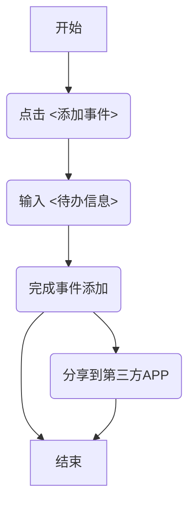
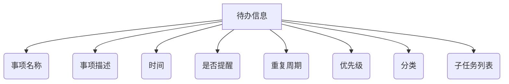
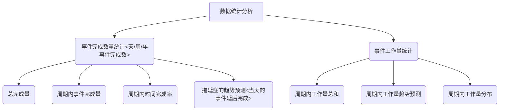
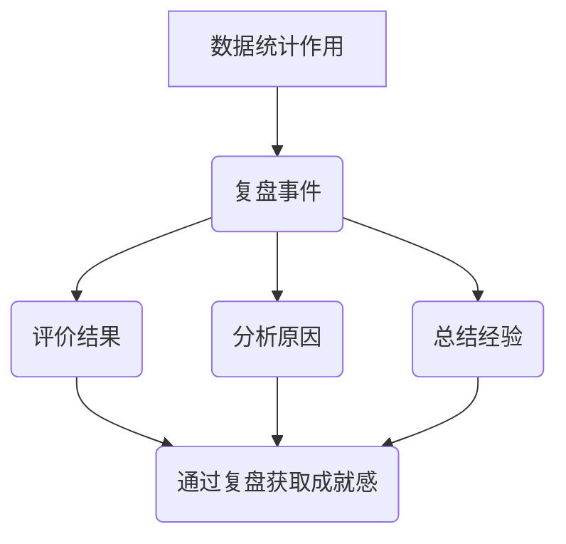

# TODO-项目介绍

### 相关文献

- TODO 最适合练习主流框架的应用：https://blog.csdn.net/qq_15988951/article/details/82905683
- 编写一个非常精美的Fultter Todo-List项目：https://segmentfault.com/a/1190000019972838

-  滴答清单最强任务管理系统：https://www.jianshu.com/p/26113da88908
- 待办清单：功能点调研及产品需求文档：http://www.woshipm.com/evaluating/4261554.html

### 确定需求

待讨论，以下为已有需求，可以根据讨论进行调整改动

##### TODO核心功能流程

##### 待办信息数据结构

##### 数据统计

#### 数据统计的作用

#### 团队分工

待讨论

