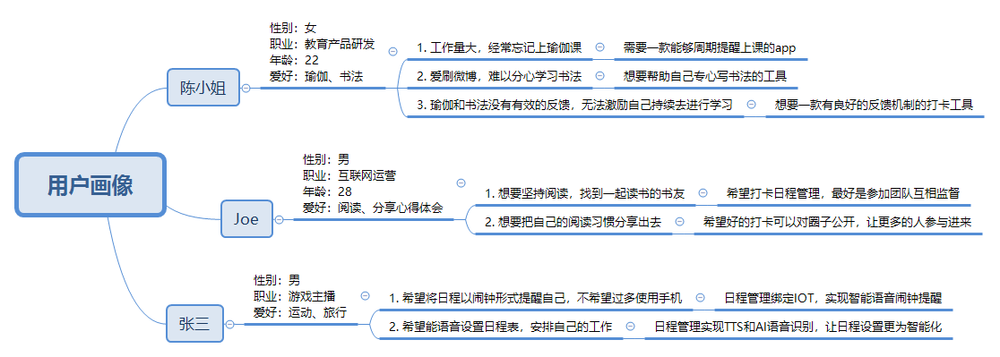
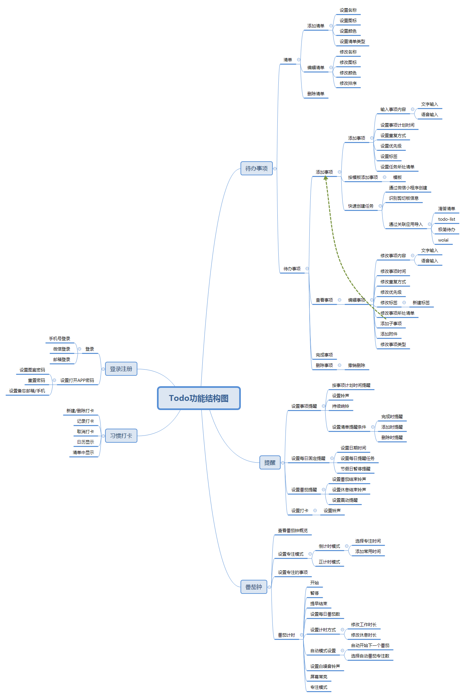

# 产品需求文档

## 修订日志

|    日期    |  版本  | 变化 | 简要描述     | 作者 |
| :--------: | :----: | :--: | :----------- | ---- |
| 2021-08-16 | V0.0.2 |  A   | 用户画像绘制 | ifun |
| 2021-08-12 | V0.0.1 |  A   | 起稿         | ifun |

变化状态:A——增加，M——修改，D——删除

## 约定俗成

### 添加个人意见格式

```Advice
@Advice by ifun888
xxxxxxx
xxxxxxx
```

## 产品介绍

ToDo是一款多端应用，为用户提供日程管理、事项提醒、专注做事、习惯养成等


## 需求整理


### 用户画像




### 需求汇总

| 序号 |               使用场景               | 问题需求                                          | 对应功能                                   |
| :--: | :----------------------------------: | :------------------------------------------------ | ------------------------------------------ |
|  1   |      工作量大，经常忘记上瑜伽课      | 需要一款能够周期提醒上课的App                     | 周期打卡功能                               |
|  2   |      爱刷微博，难以分心学习书法      | 想要帮助自己专心写书法的工具                      | 类似于番茄钟的专注功能                     |
|  3   |   想要坚持阅读，找到一起读书的书友   | 希望打卡日程管理，最好是参加团队互相监督          | 互助打卡功能，好友助力监督                 |
|  4   |     想要把自己的阅读习惯分享出去     | 希望好的打卡可以对圈子公开，让更多的人参与进来    | 建立习惯圈子，评分机制，用户交集           |
|  5   |   希望将日程以语音闹钟形式提醒自己   | 日程管理绑定IOT，实现智能语音闹钟提醒             | 开发嵌入式日程管理软件，同步日程，语音提醒 |
|  6   | 希望能语音设置日程表，安排自己的工作 | 日程管理实现TTS和AI语音识别，让日程设置更为智能化 | TTS、AI语音                                |

# 产品结构


## 产品结构图




